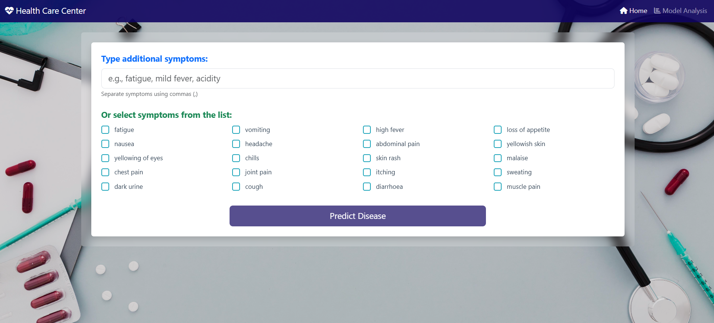
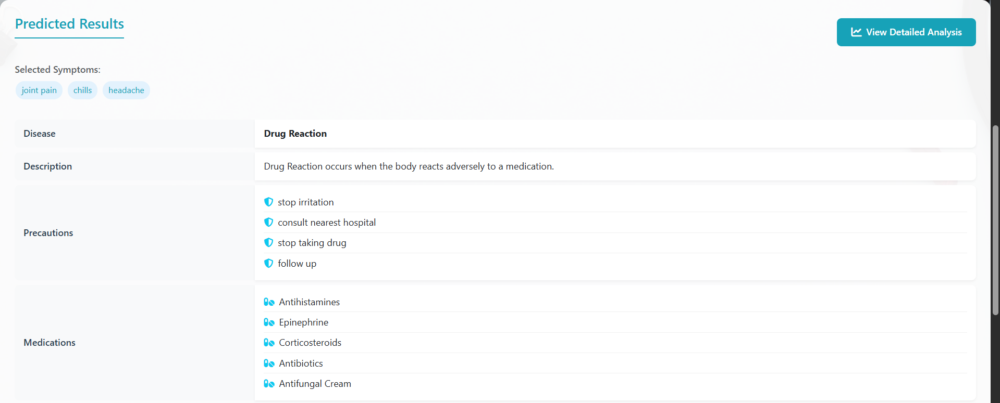
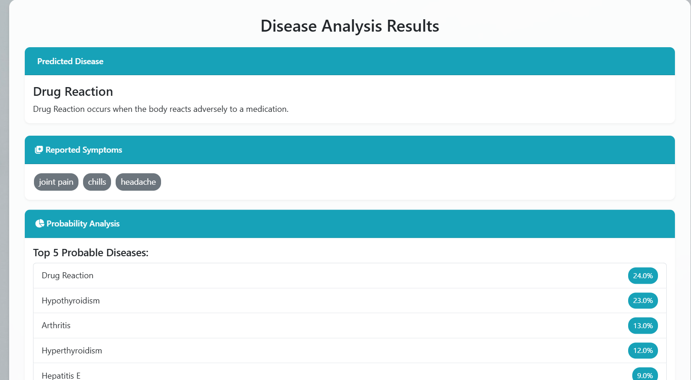
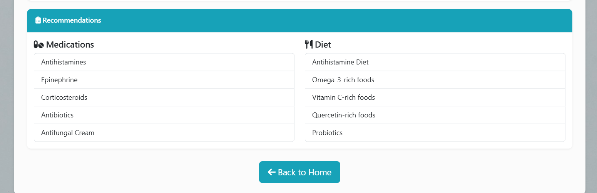

# Disease Prediction and Medical Recommendation System

A machine learning-based web application that predicts diseases based on symptoms and provides medical recommendations including medications, diet plans, and workout suggestions.

## Screenshots

### Home Page


### Disease Prediction Interface


### Analysis Results


### Model Analysis Dashboard


## Features

- **Disease Prediction**: Predicts diseases based on user-reported symptoms using a Random Forest model
- **Symptom Selection**: 
  - Text input for symptoms
  - Checkbox selection from common symptoms
  - Fuzzy matching for symptom correction
- **Detailed Analysis**:
  - Disease description
  - Precautions
  - Recommended medications
  - Diet suggestions
  - Workout recommendations
- **Model Analysis**:
  - Model performance metrics
  - Disease distribution visualization
  - Symptom importance analysis
  - Accuracy comparison between models

## Technologies Used

- **Backend**:
  - Python
  - Flask
  - Scikit-learn
  - Pandas
  - NumPy
  - FuzzyWuzzy

- **Frontend**:
  - HTML5
  - CSS3
  - Bootstrap 5
  - JavaScript
  - Font Awesome
  - Select2

- **Machine Learning**:
  - Random Forest Classifier
  - Support Vector Machine (SVC)
  - Gradient Boosting Classifier

## Setup Instructions

1. **Clone the repository**:
   ```bash
   git clone https://github.com/yourusername/Disease-Prediction-and-Medical-Recommendation-System.git
   cd Disease-Prediction-and-Medical-Recommendation-System
   ```

2. **Create a virtual environment**:
   ```bash
   python -m venv venv
   source venv/bin/activate  # On Windows: venv\Scripts\activate
   ```

3. **Install dependencies**:
   ```bash
   pip install -r requirements.txt
   ```

4. **Run the application**:
   ```bash
   python main.py
   ```

5. **Access the application**:
   Open your web browser and go to `http://localhost:5000`

## Project Structure

```
Disease-Prediction-and-Medical-Recommendation-System/
├── main.py                 # Flask application
├── disease_prediction_system.ipynb  # Model development notebook
├── model/
│   └── RandomForest.pkl    # Trained model
├── kaggle_dataset/         # Dataset files
│   ├── Training.csv
│   ├── Testing.csv
│   ├── symptoms_df.csv
│   ├── precautions_df.csv
│   ├── workout_df.csv
│   ├── description.csv
│   ├── medications.csv
│   └── diets.csv
├── static/
│   ├── bgCover.jpg
│   └── img.png
├── templates/
│   ├── index.html
│   ├── analysis.html
│   └── view_model_analysis.html
└── requirements.txt
```

## Model Performance

The system uses multiple machine learning models for disease prediction:
- Random Forest Classifier: 100% accuracy
- Support Vector Machine: 100% accuracy
- Gradient Boosting Classifier: 100% accuracy

## Contributing

1. Fork the repository
2. Create your feature branch (`git checkout -b feature/AmazingFeature`)
3. Commit your changes (`git commit -m 'Add some AmazingFeature'`)
4. Push to the branch (`git push origin feature/AmazingFeature`)
5. Open a Pull Request

## License

This project is licensed under the MIT License - see the LICENSE file for details.

## Acknowledgments

- Dataset sourced from Kaggle
- Icons provided by Font Awesome
- UI components from Bootstrap

## Project Overview
The project files are organized into the following directories:

### 1. kaggle_dataset
- `